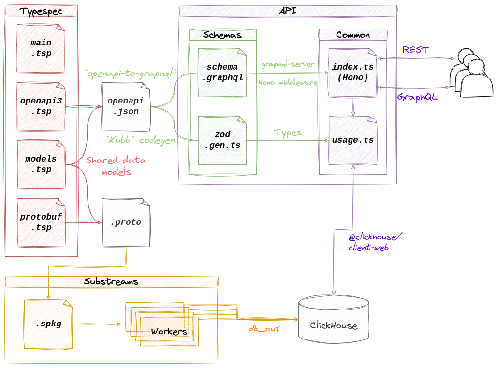

# Antelope Transactions API

[](https://github.com/pinax-network/antelope-transactions-api/actions/workflows/bun-test.yml)

> Transactions information from the Antelope blockchains, powered by [Substreams](https://substreams.streamingfast.io/)

<a href="https://pinax.network/en/chain/eos"></a>
<a href="https://pinax.network/en/chain/wax"></a>

## Swagger API

### Usage

| Method | Path | Query parameters<br>(* = **Required**) | Description |
| :---: | --- | --- | --- |
| GET <br>`text/html` | `/` | - | [Swagger](https://swagger.io/) API playground |
| GET<br>`application/json` | `/actions/name/{name}` | **`name*`** | Actions by name |
| GET<br>`application/json` | `/actions/account/{account}` | **`account*`** | Actions by account |
| GET<br>`application/json` | `/actions/date/{date}` | **`date*`** | Actions by date |
| GET<br>`application/json` | `/blocks/date/{date}` | **`date*`** | Blocks by date |
| GET<br>`application/json` | `/blocks/hash/{hash}` | **`hash*`** | Blocks by hash |
| GET<br>`application/json` | `/blocks/number/{number}` | **`number*`** | Blocks by number |
| GET<br>`application/json` | `/dbops/contract/{contract}` | **`contract*`** | DBOps by contract |
| GET<br>`application/json` | `/dbops/scope/{scope}` | **`scope*`** | DBOps by scope |
| GET<br>`application/json` | `/dbops/pk/{pk}` | **`pk*`** | DBOps by primary key |
| GET<br>`application/json` | `/dbops/date/{date}` | **`date*`** | DBOps by date |
| GET<br>`application/json` | `/transactions/hash/{hash}` | **`hash*`** | Transactions by hash |
| GET<br>`application/json` | `/transactions/date/{date}` | **`date*`** | Transactions by date |

### Docs

| Method | Path | Description |
| :---: | --- | --- |
| GET <br>`application/json` | `/openapi` | [OpenAPI](https://www.openapis.org/) specification |
| GET <br>`application/json` | `/version` | API version and Git short commit hash |

### Monitoring

| Method | Path | Description |
| :---: | --- | --- |
| GET <br>`text/plain` | `/health` | Checks database connection |
| GET <br>`text/plain` | `/metrics` | [Prometheus](https://prometheus.io/) metrics |

## GraphQL

Go to `/graphql` for a GraphIQL interface.

### `X-Api-Key`

Use the `Variables` tab at the bottom to add your API key:
```json
{
  "X-Api-Key": "changeme"
}
```

### Additional notes

- Don't forget to request the `meta` fields in the response to get access to pagination and statistics !

## Requirements

- [ClickHouse](clickhouse.com/), databases should follow a `{chain}_transactions_{version}` naming scheme. Database tables can be setup using the [`schema.sql`](./schema.sql) definitions created by the [`create_schema.sh`](./create_schema.sh) script.
- A [Substream sink](https://substreams.streamingfast.io/reference-and-specs/glossary#sink) for loading data into ClickHouse. We recommend [Substreams Sink ClickHouse](https://github.com/pinax-network/substreams-sink-clickhouse/) or [Substreams Sink SQL](https://github.com/pinax-network/substreams-sink-sql). You should use the generated [`protobuf` files](static/@typespec/protobuf) to build your substream. This Transactions API makes use of the [`substreams-raw-blocks`](https://github.com/pinax-network/substreams-raw-blocks/) Antelope substream.

### API stack architecture



### Setting up the database backend (ClickHouse)

#### Without a cluster

Example on how to set up the ClickHouse backend for sinking [EOS](https://pinax.network/en/chain/eos) data.

1. Start the ClickHouse server

```console
clickhouse server
```

2. Create the transactions database

```console
echo "CREATE DATABASE eos_transactions_v1" | clickhouse client -h <host> --port 9000 -d <database> -u <user> --password <password>
```

3. Run the [`create_schema.sh`](./create_schema.sh) script

```console
./create_schema.sh -o /tmp/schema.sql
```

4. Execute the schema

```console
cat /tmp/schema.sql | clickhouse client -h <host> --port 9000 -d <database> -u <user> --password <password>
```

5. Run the [sink](https://github.com/pinax-network/substreams-sink-sql)

```console
substreams-sink-sql run clickhouse://<username>:<password>@<host>:9000/eos_transactions_v1 \
https://github.com/pinax-network/substreams-raw-blocks/releases/download/antelope-v0.1.0/raw-blocks-antelope-v0.1.0.spkg `#Substreams package` \
-e eos.substreams.pinax.network:443 `#Substreams endpoint` \
1: `#Block range <start>:<end>` \
--final-blocks-only --undo-buffer-size 1 --on-module-hash-mistmatch=warn --batch-block-flush-interval 100 --development-mode `#Additional flags`
```

6. Start the API

```console
# Will be available on locahost:8080 by default
antelope-transactions-api --host <host> --database eos_transactions_v1 --username <username> --password <password> --verbose
```

#### With a cluster

If you run ClickHouse in a [cluster](https://clickhouse.com/docs/en/architecture/cluster-deployment), change step 2 & 3:

2. Create the transactions database

```console
echo "CREATE DATABASE eos_transactions_v1 ON CLUSTER <cluster>" | clickhouse client -h <host> --port 9000 -d <database> -u <user> --password <password>
```

3. Run the [`create_schema.sh`](./create_schema.sh) script

```console
./create_schema.sh -o /tmp/schema.sql -c <cluster>
```

4. 5. 6. Follow the same steps as without a cluster.

## [`Bun` Binary Releases](https://github.com/pinax-network/antelope-transactions-api/releases)

> [!WARNING]
> Linux x86 only

```console
$ wget https://github.com/pinax-network/antelope-transactions-api/releases/download/v0.1.0/antelope-transactions-api
$ chmod +x ./antelope-transactions-api
$ ./antelope-transactions-api --help                                                                          
Usage: antelope-transactions-api [options]

Transactions information from the Antelope blockchains

Options:
  -V, --version            output the version number
  -p, --port <number>      HTTP port on which to attach the API (default: "8080", env: PORT)
  --hostname <string>      Server listen on HTTP hostname (default: "localhost", env: HOSTNAME)
  --host <string>          Database HTTP hostname (default: "http://localhost:8123", env: HOST)
  --database <string>      The database to use inside ClickHouse (default: "default", env: DATABASE)
  --username <string>      Database user (default: "default", env: USERNAME)
  --password <string>      Password associated with the specified username (default: "", env: PASSWORD)
  --max-limit <number>     Maximum LIMIT queries (default: 10000, env: MAX_LIMIT)
  -v, --verbose <boolean>  Enable verbose logging (choices: "true", "false", default: false, env: VERBOSE)
  -h, --help               display help for command
```

## `.env` Environment variables

```env
# API Server
PORT=8080
HOSTNAME=localhost

# Clickhouse Database
HOST=http://127.0.0.1:8123
DATABASE=default
USERNAME=default
PASSWORD=
MAX_LIMIT=500

# Logging
VERBOSE=true
```

## Docker environment

- Pull from GitHub Container registry

**For latest tagged release**
```bash
docker pull ghcr.io/pinax-network/antelope-transactions-api:latest
```

**For head of `main` branch**
```bash
docker pull ghcr.io/pinax-network/antelope-transactions-api:develop
```

- Build from source
```bash
docker build -t antelope-transactions-api .
```

- Run with `.env` file
```bash
docker run -it --rm --env-file .env ghcr.io/pinax-network/antelope-transactions-api
```

## Contributing

See [`CONTRIBUTING.md`](CONTRIBUTING.md).

### Quick start

Install [Bun](https://bun.sh/)

```console
$ bun install
$ bun dev
```

**Tests**
```console
$ bun lint
$ bun test
```
